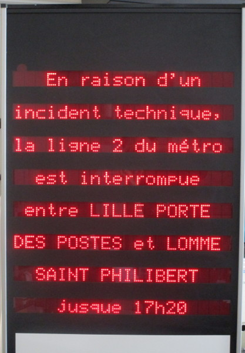

# rpi-afegedisplay-remote
Raspberry PI replacement for Afege/Charvet/IBLE/Tast LED display IR remote control

Nous avons un (très cher à l'époque) afficheur à LEDs, qui était piloté via un vieux boitier ethernet par un logiciel nommé "WinCom", totalement inscriptable et pas automatisable du tout, en plus d'utiliser un port tcp/ip tout bizarre. En enlevant le boitier, il était possible de piloter directement le panneau par RS232. Mais il n'a pas été possible de pratiquer le reverse-engineering a cause d'un CRC mystérieux. Par contre, il y avait aussi une télécommande infrarouge presque oubliée et sûrement jamais utilisée, et la solution a été d'intercaler un raspberry pi entre le récepteur infrarouge et le panneau, et d'enregistrer les codes de chaque touche...

